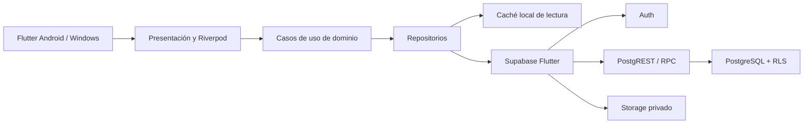
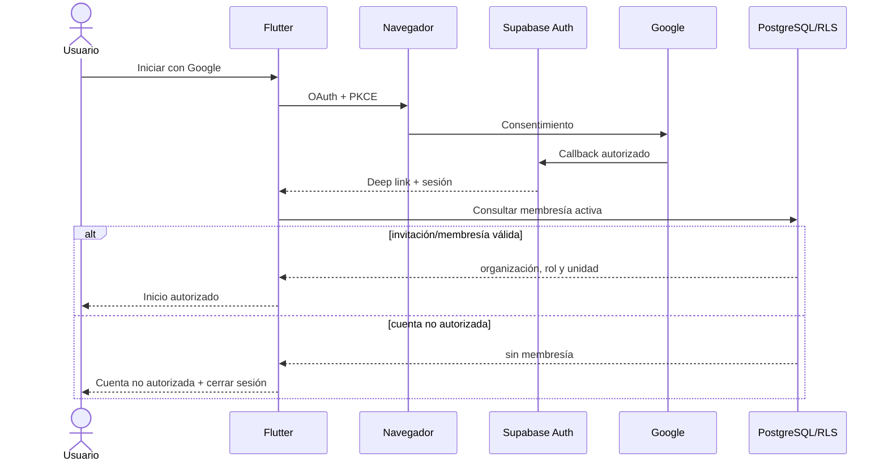
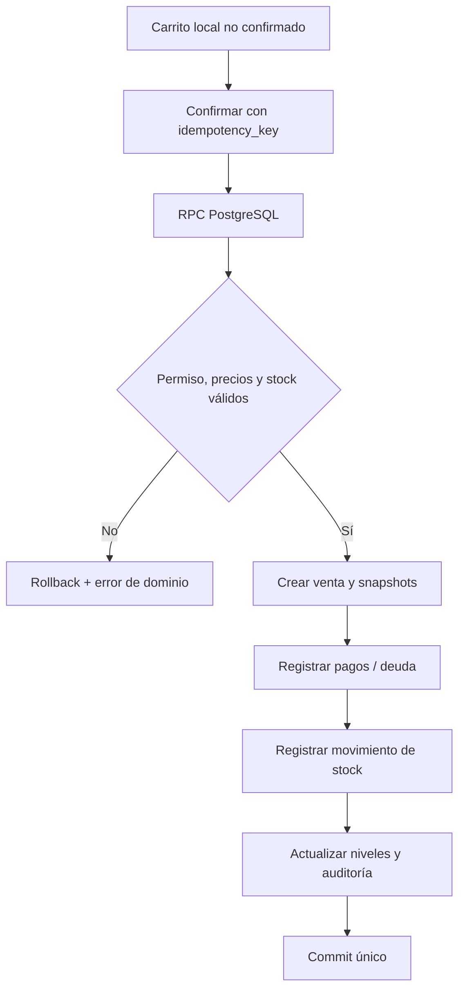
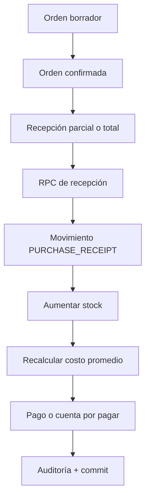
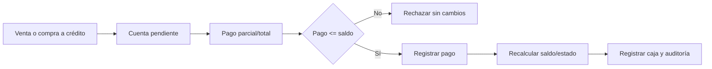
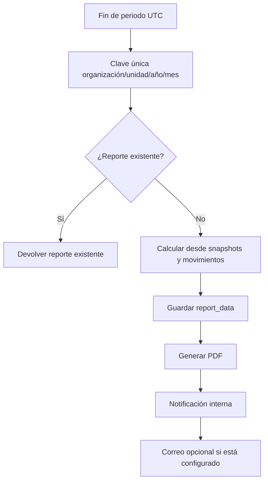
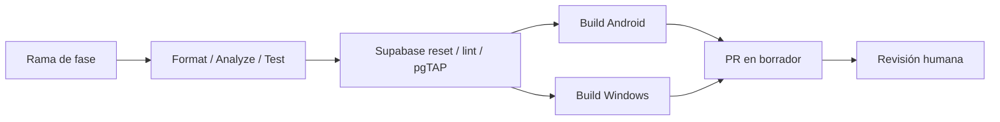

# Arquitectura

## Decisiones rectoras

- Flutter estable y Material 3 para una sola base Android/Windows.
- Feature-first con dependencias hacia el dominio, no hacia widgets.
- Riverpod para estado e inyección; `go_router` para navegación.
- Supabase/PostgreSQL como backend y autoridad.
- RLS para aislamiento; RPC transaccionales para cambios críticos futuros.
- Caché futura para lectura, nunca como autoridad de inventario.
- Edge Functions solo cuando PostgreSQL/Auth/Storage no resuelvan el caso de forma segura.

## Contexto general



## Capas Flutter

```text
lib/
├── app/                  arranque, aplicación y observers
├── core/
│   ├── config/           dart-define y validación
│   ├── errors/           errores de dominio
│   ├── routing/          rutas y shell responsive
│   ├── security/         sesión segura y límites del cliente
│   ├── theme/            tokens y ThemeData
│   └── widgets/          componentes reutilizables
└── features/
    ├── auth/
    ├── dashboard/
    ├── balance/
    ├── debts/
    ├── inventory/
    └── settings/
```

No se crean repositorios o casos de uso ficticios para pantallas sin datos. Las capas `domain` y `data` aparecen dentro de una feature cuando se implemente una regla real.

## Navegación responsive

- Menos de 840 px: `NavigationBar` con Inicio, Balance, Deudas e Inventario.
- Desde 840 px: `NavigationRail` persistente con los mismos destinos y Configuración.
- Configuración se abre desde el encabezado en móvil.
- Acciones de fases futuras aparecen deshabilitadas y etiquetadas; nunca ejecutan una operación simulada.
- La vista previa de depuración no equivale a autenticación.

## Flujo de autenticación previsto

La Fase 0 solo prepara este diseño.



## Flujo futuro de venta



## Flujo futuro de compra



## Flujo futuro de deuda



## Reporte mensual futuro



## Flujo de despliegue



## Manejo de configuración

`AppConfig` lee únicamente constantes públicas de compilación. Si faltan URL o publishable key, la app muestra un estado de configuración pendiente sin imprimir los valores. Los correos e identificadores de propietarios no forman parte de `AppConfig`, assets ni `dart-define`: sus identidades se administran exclusivamente en Supabase mediante invitaciones, membresías o procedimientos seguros del lado servidor. `service_role`, secretos OAuth y llaves de firma quedan fuera del cliente en todos los ambientes.

## Observabilidad

La Fase 0 no integra servicios externos. Los errores se transforman en mensajes de dominio. Una fase posterior añadirá logging estructurado con redacción de datos; nunca se enviarán tokens, SQL o PII innecesaria.

## Decisiones diferidas

- Motor de caché local.
- Biblioteca decimal Dart para reglas monetarias.
- Generación PDF/CSV.
- Escáner Android.
- Proveedor opcional de correo.
- Empaquetado e instalador Windows.

Cada decisión debe evaluar mantenimiento, licencia, soporte Android/Windows y ausencia de suscripción obligatoria.
